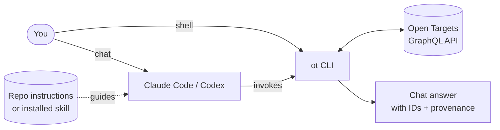

# opentargets-cli

Agent-ready CLI for querying the [Open Targets Platform](https://platform.opentargets.org/) GraphQL API.

Install the `ot` CLI, start Claude Code or Codex, and ask Open Targets questions in plain English. This repo ships the CLI and agent instructions; the agent builds the query, while `ot` handles transport, ID resolution, schema inspection, JSON output, and provenance.

## How it works



## Quick start

Prerequisite: install [`uv`](https://docs.astral.sh/uv/).

## Install Agent Skill

Copy this into a new Codex or Claude Code session:

```text
Set up opentargets-cli, the Open Targets CLI and skill for agents.

If uv is available:
uv tool install git+https://github.com/nickzren/opentargets-cli.git && ot install-skills

If npm is available and `ot` is already installed:
npx skills add nickzren/opentargets-cli --skill opentargets-cli -y -g

Otherwise:
dir="${XDG_DATA_HOME:-$HOME/.local/share}/agent-skills"
repo="$dir/opentargets-cli"
mkdir -p "$dir"
test -d "$repo" || gh repo clone nickzren/opentargets-cli "$repo"
"$repo/install.sh"
```

### From package

```sh
uv tool install git+https://github.com/nickzren/opentargets-cli.git
ot install-skills
ot doctor
codex                              # or: claude
```

### From repo

```sh
git clone https://github.com/nickzren/opentargets-cli.git
cd opentargets-cli
./scripts/install.sh               # install the CLI, skill(s), and run checks
codex                              # or: claude
```

Then ask:

> What diseases is BRCA1 associated with?

> Show drugs linked to rheumatoid arthritis.

> What evidence supports EGFR in lung adenocarcinoma?

For repo-local use, start Codex or Claude Code from this directory. `AGENTS.md` and `CLAUDE.md` tell the agent how to use `ot`.

For chat-anywhere use, run:

```sh
ot install-skills
```

`ot install-skills` installs detected agent skill(s). If a skill already exists, it is moved to a timestamped backup before installing the new copy. Use `ot install-skills --agent all` to install both Claude Code and Codex skills explicitly.

Restart the agent session after installing or updating the skill.

## CLI usage

The same tool works as a plain shell CLI:

```bash
ot tools
ot doctor
ot install-skills
ot meta --no-downloads
ot resolve "BRCA1" --entity target
ot schema --category targets --category associations
ot gql --query 'query { meta { name } }'
ot gql --query-file query.graphql --variables-list vars.ndjson --key-field ensemblId
```

`ot` exposes seven agent-facing primitives (`meta`, `tools`, `describe`, `resolve`, `schema`, `type`, `gql`) plus two setup commands (`doctor`, `install-skills`). Output is JSON by default and includes status plus request context; live API commands also include Open Targets API/data-release provenance.

Run `ot --help` or `ot describe <command>` for the full command contract.

## Agent Rules

Agent-specific workflow rules live in `AGENTS.md`, `CLAUDE.md`, and `skills/opentargets-cli/SKILL.md`.

## Validation

```bash
python3 -m compileall src
python -m pytest tests
python -m pytest tests -m live
python -m pytest tests/skill -m 'live and skill'
```

Offline tests run by default. Live and skill-pattern tests are opt-in checks against the Open Targets API.
